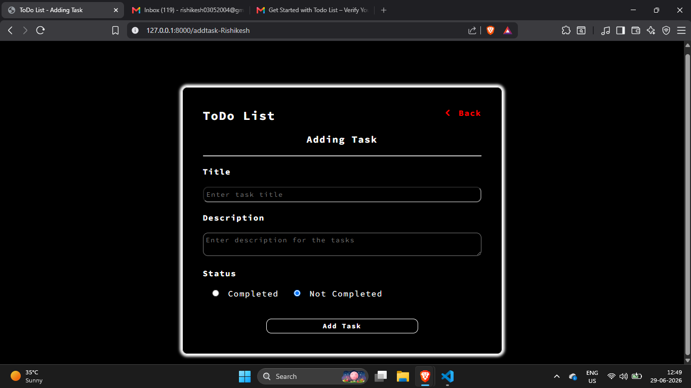
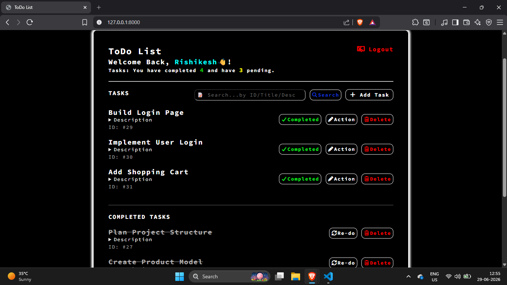
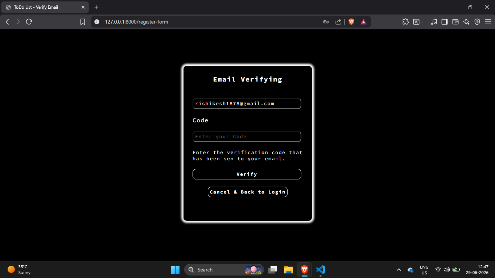
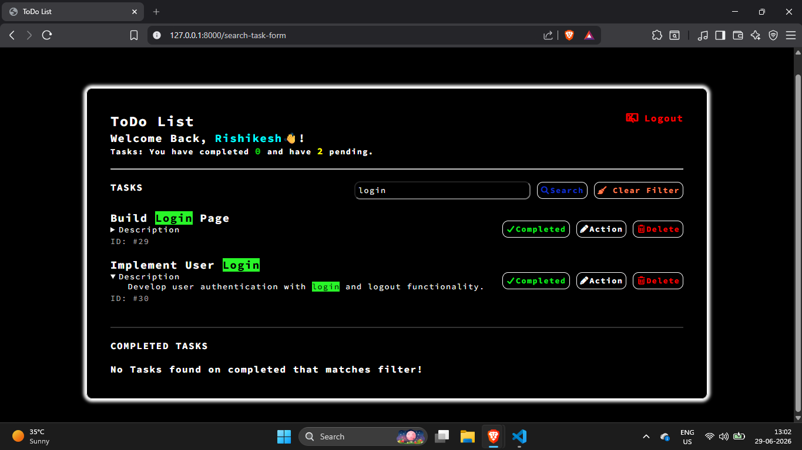
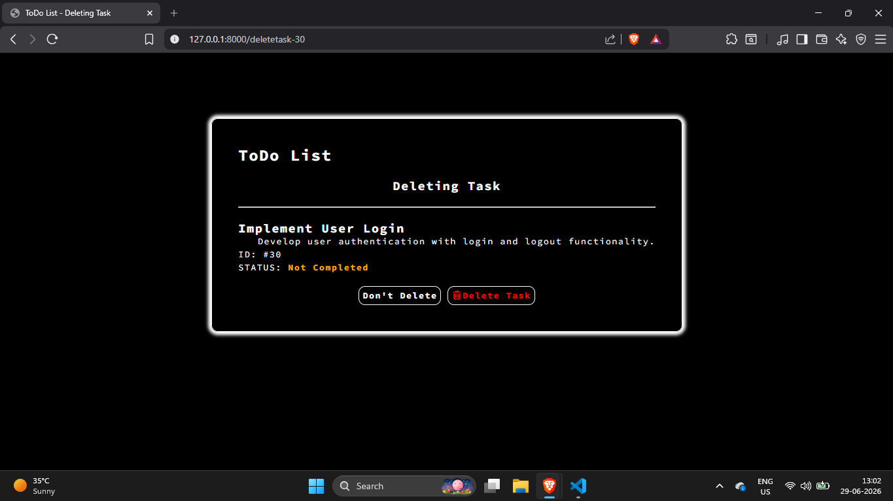
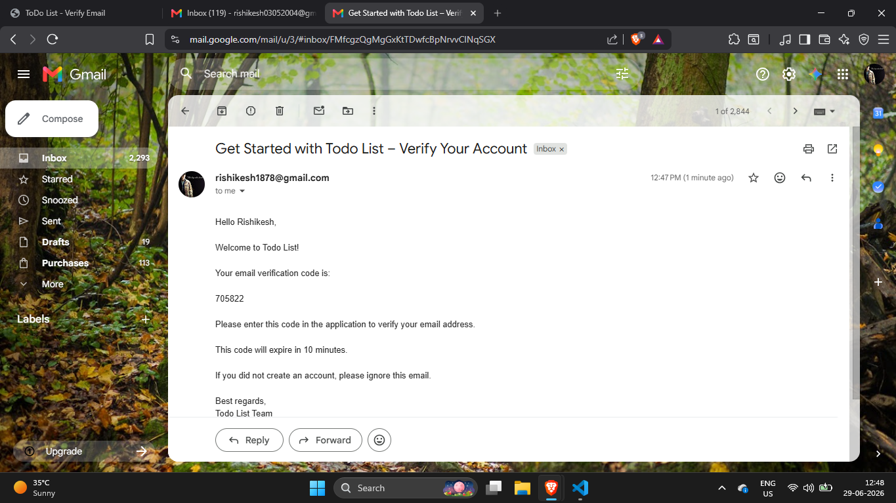

# ✅ To-Do List Django Project

A clean and functional Django web application for managing daily tasks with user authentication, task management, email verification, and password recovery.

## 🔗 Live Demo
- Demo Link: [Click here to view the live demo](https://your-live-demo-link.com)
- Replace this with your actual deployment link when available.

## 🌟 Project Overview
This project is a simple yet practical Django-based to-do list application designed to help users organize their tasks efficiently. It demonstrates core web development concepts such as:
- Django project and app structure
- URL routing and views
- Templates and form handling
- SQLite database integration with Django ORM
- User authentication and session-based login
- Email-based verification and password recovery

## ✨ Features
- User registration and login
- Email verification during signup
- Forgot password flow with email verification
- Add, update, delete, and view tasks
- Mark tasks as completed or pending
- Search tasks by title or description
- Logout and session-based access control

## 🛠️ Tech Stack
- Python
- Django
- SQLite
- HTML/CSS
- SMTP email integration

## 📂 Project Structure
```text
MyProject/
├── manage.py
├── MyProject/
│   ├── settings.py
│   ├── urls.py
│   └── wsgi.py
├── ToDoList/
│   ├── views.py
│   ├── models.py
│   └── migrations/
├── templates/
└── static/
```

## ▶️ Installation and Setup
1. Clone or open the project folder.
2. Navigate to the project directory:
   ```bash
   cd MyProject
   ```
3. Create and activate a virtual environment:
   ```bash
   python -m venv venv
   venv\Scripts\activate
   ```
4. Install Django:
   ```bash
   pip install django
   ```
5. Apply database migrations:
   ```bash
   python manage.py migrate
   ```
6. Run the development server:
   ```bash
   python manage.py runserver
   ```
7. Open your browser and visit:
   ```text
   http://127.0.0.1:8000/
   ```

## 📧 Email Configuration
The project includes email verification and password reset using SMTP. To make it work properly:
- Update the sender email and app password in [MyProject/ToDoList/views.py](MyProject/ToDoList/views.py)
- Use a valid Gmail account or another SMTP provider

## 📸 Screenshots
Here are some screenshots of the application:













## ⭐ Highlights
This project showcases practical implementation of:
- Full-stack web development using Django
- CRUD application development
- Authentication and authorization concepts
- Database design and migrations
- User-friendly form handling and UI flow
- Python-based web application development

## 👤 Author
Created as a Django learning project with a clean and functional task management workflow.
